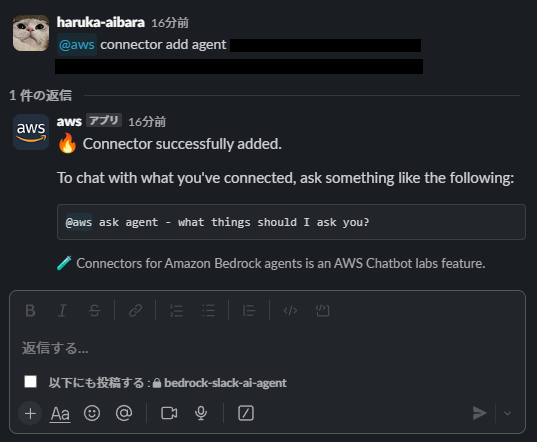

# bedrock-slack-ai-agent
Amazon Bedrockを利用したSlack AIエージェント

## Architecture Diagram
Note: This architecture-beta Mermaid diagram may not render correctly on github.com due to current platform limitations.

```mermaid
architecture-beta
    group communication(logos:aws)[cloud]

    service agent(logos:aws)[Amazon Bedrock Agent no icon yet] in communication
    service chatbot(logos:aws)[AWS Chatbot no icon yet] in communication

    service slack(logos:slack-icon)[Slack] 

    slack:R <--> L:chatbot
    chatbot:R <--> L:agent
```



## 2024-09-21 時点

本プロジェクトを Apply 後、Slack 側の設定で以下のコマンドを入力する。（プライベートチャンネルの場合は事前に /invite @aws）

```
@aws connector add {任意のコネクター名} {エージェントのARN} {エージェントのAlias}
```



これで、以下の通り agent と会話できるようになりました。

```
@aws ask {任意のコネクター名} 富士山の高さを教えてください。
```


しかし、エージェントのメモリー機能を有効化・活用するための処理が入っていないため、
１問１答（連続した会話ができない）状態です。

以下のあたりの記事を参考に、メモリー機能を追加していく予定です。

https://aws.amazon.com/jp/blogs/news/agents-for-amazon-bedrock-now-support-memory-retention-and-code-interpretation-preview/

https://docs.aws.amazon.com/bedrock/latest/userguide/agents-configure-memory.html

## エージェントのエイリアス更新時などに、既存のコネクターを削除する手順
以下のコマンドを入力する。
```
@aws connector delete [Name]
 ```

