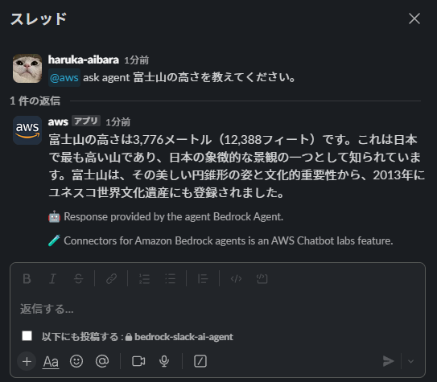

# bedrock-slack-ai-agent
Amazon Bedrockを利用したSlack AIエージェント

## 2024-09-21 時点

本プロジェクトを Apply 後、Slack 側の設定で以下のコマンドを入力する。（プライベートチャンネルの場合は事前に /invite @aws）

```
@aws connector add {任意のコネクター名} {エージェントのARN} {エージェントのAlias}
```


これで、以下の通り agent と会話できるようになりました。

```
@aws ask {任意のコネクター名} 富士山の高さを教えてください。
```



しかし、エージェントのメモリー機能を有効化・活用するための処理が入っていないため、
１問１答（連続した会話ができない）状態です。
