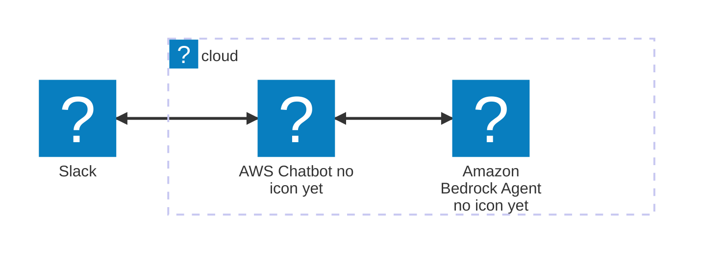

```mermaid
architecture-beta
    group communication(logos:aws)[cloud]

    service agent(logos:aws)[Amazon Bedrock Agent no icon yet] in communication
    service chatbot(logos:aws)[AWS Chatbot no icon yet] in communication

    service slack(logos:slack-icon)[Slack] 

    slack:R <--> L:chatbot
    chatbot:R <--> L:agent
```
